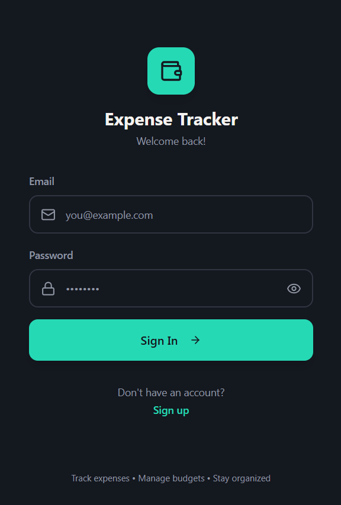
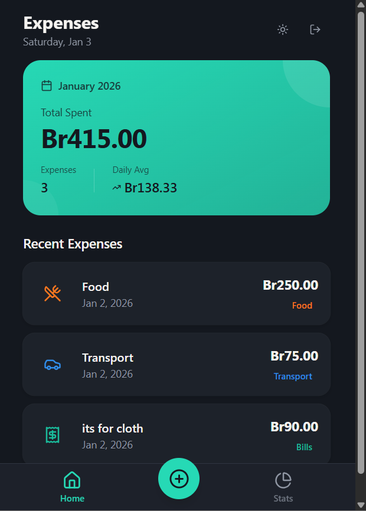

## 📸 Screenshots

<div align="center">
   
   
</div>

<<<<<<< HEAD
<<<<<<< HEAD
=======

<div align="center">
   <h1>📱 <span style="color:#4F8A8B">Expense Tracker - Android APK Guide</span> 📱</h1>
   
   
   
</div>

---

## 🚦 Prerequisites

- <span style="color:#339933">Node.js & npm</span> installed
- <span style="color:#007AFF">Capacitor</span> installed (`npm install @capacitor/core @capacitor/cli`)
- <span style="color:#3DDC84">Android Studio</span> installed

## 🛠️ Steps to Build APK

<details>
<summary><b>Expand for step-by-step instructions</b></summary>

1️⃣ **Install dependencies:**

```bash
npm install
```

2️⃣ **Build the web app:**

```bash
npm run build
```

3️⃣ **Initialize Capacitor (if not done):**

```bash
npx cap init
```

4️⃣ **Add Android platform:**

```bash
npm install @capacitor/android
npx cap add android
```

5️⃣ **Copy build files to Android project:**

```bash
npx cap copy
```

6️⃣ **Open Android project in Android Studio:**

```bash
npx cap open android
```

7️⃣ **In Android Studio, go to:**

```
Build > Generate App Bundles or APKs > Generate APKs
```

Wait for the build to finish.

</details>

---

## 📂 Where to Find the APK

After building, your APK will be located at:

```diff
android/app/build/outputs/apk/debug/app-debug.apk
```

---

## 📲 How to Install on Your Phone

1. 🚚 **Transfer** `app-debug.apk` to your Android device (USB, email, cloud, etc.).
2. 📥 **Open** the file on your device and follow the prompts to install.
3. ⚙️ **Enable installation from unknown sources** in your device settings if prompted.

---

> ℹ️ For release (signed) APK instructions, or Play Store publishing, see the official [Capacitor Documentation](https://capacitorjs.com/docs) and [Android Documentation](https://developer.android.com/studio/publish).

---

=======

> > > > > > > ba7cc176f87534c226fef048d9214f35bb1760e0
> > > > > > > 3c5dfd9e1a7dbec4f5b981e8ce08f70a1b5c2193

<div align="center">
  <h1>💸 Expense Tracker - Vite/React/Capacitor</h1>
  
  
  
  
  
  
</div>

---

## 📋 Overview

A modern, full-featured Expense Tracker app built with Vite, React, TypeScript, TailwindCSS, and Capacitor. Easily track your expenses, view summaries, and run the app as a web app or Android APK.

---

## 🏗️ Architecture

- **Frontend:** React + Vite + TypeScript + TailwindCSS
- **Mobile Wrapper:** Capacitor (Android APK)
- **Backend:** Supabase (for authentication & data)

### Folder Structure

```
src/
  components/      # UI and feature components
    expenses/      # Expense-related components
    layout/        # Layout components
    ui/            # UI primitives
  hooks/           # Custom React hooks
  integrations/    # Supabase client & types
  lib/             # Utilities, validation, currency helpers
  pages/           # Page components (Auth, Index, NotFound)
  types/           # TypeScript types (e.g., expense)
```

---

## ✨ Features

- 🔒 Supabase Auth (Login, Register, Logout)
- ➕ Add expenses (category, amount, date, description)
- 📃 View expense list with real-time updates
- 🗑️ Delete expenses
- 📊 Category breakdown & monthly summary
- 💰 Currency formatting
- 🌗 Light/Dark theme toggle
- 📱 Build as Android APK (Capacitor)

---

## 🚦 Prerequisites

- Node.js & npm
- Android Studio (for APK build)
- Supabase project (for backend)

---

## 🚀 Setup & Build Instructions

1. **Clone the repo & install dependencies:**
   ```bash
   npm install
   ```
2. **Configure Supabase:**
   - Add your Supabase URL and anon key to `.env` or `src/integrations/supabase/client.ts` as needed.
3. **Run locally (web):**
   ```bash
   npm run dev
   ```
4. **Build for production:**
   ```bash
   npm run build
   ```
5. **Capacitor Android APK:**
   ```bash
   npx cap init         # (if not done)
   npm install @capacitor/android
   npx cap add android
   npx cap copy
   npx cap open android
   # In Android Studio: Build > Generate APKs
   ```

---

## 📦 Data Model

**Expense Entity:**

```ts
{
  id: string;
  amount: number;
  category: "food" | "transport" | "rent" | "bills" | "other";
  date: string;
  description: string;
  createdAt: string;
}
```

**Supabase Table:**

- Table: `expenses`
- Columns: id, user_id, amount, category, date, description, created_at

---

## 📚 Dependencies

- React, React DOM, React Router
- Vite, TypeScript
- TailwindCSS
- Supabase JS
- Capacitor (core, cli, android)
- Radix UI, React Hook Form, Zod, date-fns, and more (see `package.json`)

---

## 📝 Notes

- Responsive, mobile-first UI
- Easily extendable for new features
- Follows modern React and TypeScript best practices

---

## 📄 License

# This project is open source and available for educational purposes.

> > > > > > > ba7cc176f87534c226fef048d9214f35bb1760e0
